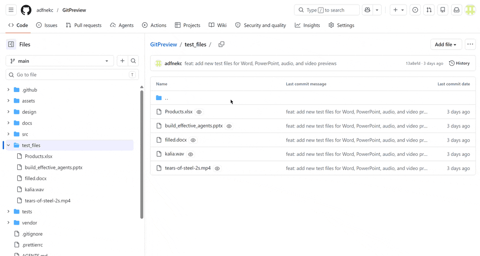

<div align="center">
  
  <h1>GitPreview</h1>
  <p><b>Preview 20+ file types directly on GitHub.</b> No downloads. No new tabs. Just click and view.</p>

  

  <p>
    <a href=""></a>
    <a href=""></a>
    <a href="LICENSE"></a>
  </p>
</div>

---

Tired of downloading files just to see what's inside them? GitPreview renders audio, video, PDF, Office documents, fonts, and more — right inside your GitHub repository page.

## Quick start

1. **Install** the extension (Chrome / Firefox)
2. **Visit** any GitHub repository
3. **Click** a supported file — preview loads automatically

## Supported formats

| Type      | Extensions                                           |
| --------- | ---------------------------------------------------- |
| Audio     | mp3, wav, ogg, m4a, flac, aac                        |
| Video     | mp4, webm, mov, avi, mkv                             |
| PDF       | pdf                                                  |
| Documents | docx (Word), xlsx/xls (Excel), pptx/ppt (PowerPoint) |
| Fonts     | ttf, otf, woff, woff2                                |

## Features

- **Inline & modal preview** — inline on file pages, modal from directory listings
- **Streaming video** — chunked loading via MediaSource API, no full download
- **Network-aware** — warns before large downloads on cellular connections
- **Zoom & pan** — on slides and images
- **Keyboard shortcuts** — Space, arrows for audio/video control
- **Download** — save files directly from the preview player

## Development

```bash
npm install
npm run dev          # Watch-mode build
npm test             # Unit tests
npm run build        # Production build to dist/
```

Load unpacked from `dist/` in Chrome Extensions (`chrome://extensions` → Developer mode → Load unpacked).

See [CONTRIBUTING.md](CONTRIBUTING.md) for how to add new preview types.

## License

MIT
